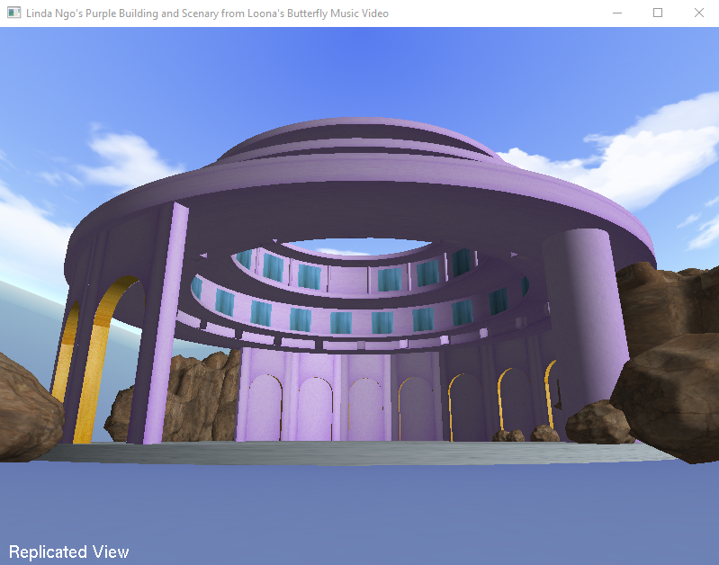

Final Project: Purple Building and Scenery from Loona's Butterfly Music Video

Linda Ngo
Last edit: December 10, 2024
CSCI 4229 Fall 2024

Purpose: To implement a purple building and scenery from Loona's Butterfly Music Video with different shapes and objects including the lighting, rocks, and the background. I would love for you too look at the building I have built. Although it may not look like much but the purple building was very difficult to build for me. I made sure to carefully put the pieces all together from top to bottom. Making sure the top part of the building was perfectly built before going onto the next level of the building. All the functions above the build function is all the code for the purple building and the skybox. I used the LoadTexBMP and LoadOBJ to load the texture and the .obj file for my rock models. 

        Skybox:
                I was deciding on a SkyDome or a SkyBox but I decided on a Skybox to give a better look on the scene as if we are at the studio where Loona is filming their music video. 
        
        Purple Building: (Most difficult for me because I manually coded everything in this part to replicate the original scene)
                 - I wanted to try to code it manually without using Blender
                 - This is with the help of AI 
                 - for the vertices, vertices coordinates and learned how to get cylindrical normals. 
                        
        The building has 3 different levels, with 3 platforms. 
                - The first level has 4 sections with 3 consecutive windows and a space with cylinders. - While the second level has windows with spaces between them. 
                - Between the second and third level, there is a section with the platform that has small squares along the cylindrical platform. 
                - The last level, has differnt parts with the 3 archways on the left, an arch wall in the back with a gold lining, and a cylinder pole on the right. There is a space between the each group.
        
        Rocks:
                Learned how to use Blender to build my own model of rocks. 
                        Blender: 
                                I created these rock models on my own. I used youtube to learn how to use blender. From there, I created my own rock models. I then rendered the rocks onto OpenGL. Because I want to replicate the Loona scenery, I wanted to place the rocks just like the scene so I individually placed each rock in my code. The Blender portion, learning to render it on OpenGl, and placing each rock. Took me about 2 days to finish. My Blender application kept on crashing so I ended up having to restart my rock models about a couple of times so it took longer than expected. 

Why I deserve an A:
        The reason for this is because I came into this class not knowing what this class is about and I was very overwhelmed and nervous for the final project since I do not have much experience with this or design. I was not sure how I was able to get this project done but I kept pushing myself to try to improve my project and make it better. It was very difficult for me at first but I did my research and used as many resourses as I could during this project. That is also something I learned. As long as I give credit and improve on the things I have learned from others. Example is the Arch. I was having so much trouble trying to figure out how to get the arch but I was able to find something on the internet (website is down below), I was able to create archways for my project because of that. It also took my own time to learn Blender so I can implement the rocks. Although I tried make the rocks manually,it was very difficult to get the rocks like how I want it for the scene so Blender was one of my options. I'm just glad I tried my best.

        Credits: 
                - Class Lecture exercise practices. 
                - Used youtube to learn how to use blender for my rocks models. 
                - Did research on how to calculate the cylindrical normals with the help of AI. 
                - AI help with texture coordinates, correcting my normals, and learned how to work with cylindrical normals
                - Arch
                        https://stackoverflow.com/questions/20504065/arches-2d-or-3d-in-opengl
                        I was having trouble getting the arc to show up as a wall, I took some code from this but I was able to change a few things to satisfy my design by adding the radius of the arch and the height while also getting it to position how I like it. 
                - Textures
                        SkyBox Texture - https://opengameart.org/content/sky-box-sunny-day 
                        Rock Texture - https://polyhaven.com/textures/rock 
                        Building Textures - https://www.textures.com/ 

Original Loona Scenery

Replicated View

Overview of Scenery

Instructions: All you do is explore !! There are two views which is the replicated view (first person) just like the first image above, and then the view from outside of the scenery to get an overview of the scene. 

- To get a good view around the building, I recommend only using the left or right arrows first and go one full round around the building before using the other keys in the Replicated View. 

        Key bindings
                o          Change the view (only 2 views)
                                - Replicated View from Loona Scenery
                                - View from outside of the scene
                m          Toggles light movement
                r          reset the angles
                l          Toggles lighting
                []         Lower/rise light
                g/G        Decrease/increase ambient light
                j/J        Decrease/increase diffuse light
                h/H        Decrease/increase specular light
                u/U        Decrease/increase emitted light
                n/N        Decrease/increase shinines
                x          Toggle axes

        Movements
                Replicated View (First Person View)
                        w          move forward
                        s          move backwards
                        a          move left
                        d          move right
                        e          move up
                        q          move down
                        arrows     change view angle

                Overview of scenery
                        w          forward overlook scene
                        s          backward overlook scene
                        a          left overlook scene
                        d          right overlook scene
                        e          move up
                        q          move down
                        arrows     change view angle

